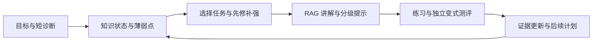
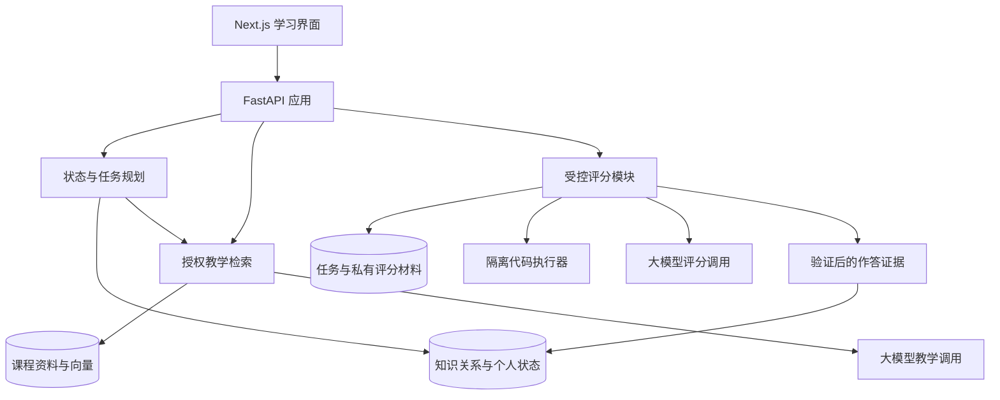

# MindOS 项目最终设计大纲

版本：v3.0｜修订日期：2026-09-26  
适用方向：大创／挑战杯等需要原型、真实应用与效果验证的项目。  
当前状态：设计阶段；下述规模、周期和验收要求为计划值，不代表已经实现或取得的效果。

## 一、项目名称、定位与首期边界

**项目名称：MindOS：基于大语言模型与动态知识状态建模的开源自适应学习平台。**

产品定位：面向高校学生与自主学习者，通过可扩展课程包、RAG 知识库、多维能力诊断和自适应任务规划，帮助学习者识别薄弱点并完成具体学习目标。平台能力与课程内容分离，可逐步接入编程、数学、语言等课程。

RAG 指 Retrieval-Augmented Generation，即检索增强生成。系统先检索适合当前问题和任务的课程资料，再由大模型结合资料进行解释、提示和反馈。

### 1. 目标用户与问题

面向需要结构化学习和持续反馈的高校学生、自主学习者，以及希望维护课程资料和练习的教师／助教。首批试点从团队能够接触的基础编程课程和大学基础课学习小组招募，不要求所有用户具备 Python 或深度学习基础。

需要通过访谈和学习过程观察验证三个问题：

- 学生能复述内容，却在推导、解题、写作或实际操作环节遇到困难。
- 学生不清楚失败源于哪个知识点，下一步补什么缺少依据。
- 课程资料较分散，通用解释与个人当前任务、能力水平不够匹配。

### 2. 平台范围与首期验证课程

采用“通用学习流程＋可配置课程包”的结构。新增课程通过补充知识点、资料、维度、任务和评分规则接入；教学质量仍需要内容审核与适用场景验证。

| 课程方向 | 定位 | 首期用途 |
| --- | --- | --- |
| Python 基础 | 面向编程入门者，不要求 PyTorch 基础 | 作为主要试点，验证概念、编码与调试任务 |
| 线性代数基础 | 面向大学基础课学习者 | 用小型单元验证概念、计算与推导任务能否共用平台流程 |
| PyTorch／深度学习 | 面向已有编程基础的学习者 | 保留为进阶课程扩展示例 |
| 英语阅读、职业技能等 | 面向其他学习目标 | 后续通过课程包与相应评分能力扩展 |

主要试点课程计划约 12–20 个知识点、30–50 道审核题目；第二课程先制作少量知识点与任务，检查接入流程和评分差异。独立测评材料另行维护。公开仓库中的小型示例包只说明课程格式，不代表已经完成完整课程或学习效果验证。

首版具备课程选择、课程包版本和课程数据隔离，后续再扩充课程数量、复杂多模态任务和任意文件上传。通用平台的定位通过不同课程的接入验证，不承诺仅导入资料即可自动完成任何学科的可靠教学。

### 3. 项目要证明的价值

- 学生能够查到与课程、问题和任务匹配的解释，并查看资料出处。
- 系统能够依据作答证据识别具体薄弱点，给出可完成的下一任务。
- 学生能通过独立变式测评检验学习结果，系统据此调整状态和后续计划。
- 团队能够报告真实使用效果、评分分歧、内容维护量和运行成本。
- 课程维护者能够在少量改动下接入第二门课程，复用已有的检索、诊断和学习规划流程。

## 二、自审结论与总体技术路线

### 1. 将基础 RAG 纳入首版

课程资料可控、需要引用出处且存在维护需求，因此本项目适合在首版建设 RAG 知识库。向量检索帮助寻找语义相关资料，术语与关键词检索补充代码符号、缩写和专业名词的匹配。

RAG 的基础是把检索到的外部信息引入生成过程；本项目采用现成模型完成检索与生成，首版不要求训练大模型。[RAG 原始论文](https://arxiv.org/abs/2005.11401)。

知识库质量、检索结果和生成过程都影响最终答案，加入向量库不能保证正确性。资料引用、证据不足处理和独立评测同步建设。

### 2. 明确各部分职责

| 部分 | 主要作用 | 数据与实现方式 |
| --- | --- | --- |
| 课程包 | 定义一门课程的知识、内容与评估方式 | 课程清单、能力维度、知识点、关系、资料与任务配置 |
| 课程 RAG 知识库 | 查找可以用于讲解和提示的课程证据 | 原文、内容片段、元数据、向量及关键词索引 |
| 领域知识图 | 表达知识点之间的先修、组成和关联关系 | 知识点表、关系边表，先修子图检查循环 |
| 学习者状态 | 记录学生在各知识点、各维度上的掌握判断 | 结构化状态、证据引用、时间与规则版本 |
| 题库与评分标准 | 提供诊断、练习、独立测评和评分依据 | 审核后的题目、评分表、答案与测试用例 |
| 大语言模型 | 结合资料生成讲解、分级提示和结构化评分建议 | 受控输入、模式约束、结果校验与调用记录 |
| 规划与更新模块 | 选择下一任务，并根据有效证据更新状态 | 可解释的服务端规则，逐步通过试点校准 |

学习者状态按学生和知识点准确查询，不依赖聊天记录的相似度检索推断。知识点关系也不直接用向量相似度替代。

总体主线为：**课程资料提供教学依据，学习证据支撑状态判断，先修关系与学习目标约束规划，大模型组织个性化教学。**

### 3. 课程包与通用流程分离

课程包声明课程编号、版本、目标用户、学习目标、能力维度、知识点、关系、资源及任务。任务选择平台已有的评分方式，例如量表评分、数值判定或隔离的代码测试。

课程包默认提供数据与声明式配置，新增可执行评分器需要单独开发、审核和部署。代码测评只在相应课程中启用，数学或语言课程无需依赖编程沙箱。

知识点和学生状态使用“课程编号＋课程版本＋知识点编号”定位；检索以课程与权限为边界。跨课程的等价知识点映射由审核者明确建立，不自动转移掌握等级。

新增课程的成本、所需平台改动和内容审核量纳入评估。课程包格式与示例在公开仓库中维护，具体约定见课程包文档。

## 三、课程知识库与内容建设

### 1. 内容来源与维护责任

优先选择教师审核的讲义、来源明确的官方文档、适合课程层级的论文片段和经过运行验证的代码示例。登记来源与使用范围；首版由管理员导入资料。

教师／助教审核关键知识点、公式、示例与评分标准；团队维护资料版本、失效链接和内容纠错。自动生成的讲解和学生聊天不自动进入共享权威知识库。

### 2. 入库流程

资料收集 → 解析清洗 → 按结构切分 → 关联知识点与教学标签 → 人工抽检 → 生成向量及关键词索引 → 发布可检索版本。

具体要求：

- 首期支持 Markdown、文本型 PDF 和规范化文档内容；扫描件与复杂公式版面在能够可靠解析后再接入。
- 保留章节标题、来源、页码或段落位置。公式保留符号定义，代码尽量按完整函数或逻辑块组织。
- 切分按语义边界进行；可从约 300–800 token 的片段试验，并按实际检索表现调整。较长示例使用小片段检索后补充所属段落。
- 每个片段关联知识点、资源类型和适用维度；难度、术语别名等标注由人工校对。
- 文档变更后增量更新，发布时切换到已完成索引的新版本；撤下资料同步失效其检索入口和相关缓存。

### 3. 片段需要保存的元数据

| 类别 | 建议字段 |
| --- | --- |
| 可追溯性 | 文档编号、片段编号、标题、来源、章节／页码、原文、内容版本 |
| 教学用途 | 课程及版本、知识点、该课程定义的能力维度、难度、资源类型、先修标签 |
| 使用边界 | 审核状态、发布状态、访问范围、教学／提示等用途 |
| 检索维护 | Embedding 模型及版本、向量维度、切分版本、内容哈希 |

存储向量时同时保留原文及引用位置。同一检索索引中的查询与文档采用兼容的 Embedding 模型、预处理和向量维度；更换模型需重建或迁移索引。

### 4. 教学材料与测评材料的访问分离

| 数据 | 使用方式 |
| --- | --- |
| 已发布课程资料 | 学生教学检索可以访问，回答提供出处 |
| 审核后的分级提示 | 根据任务模式和提示权限提供，记录使用情况 |
| 标准答案、评分表、隐藏测试 | 仅受控评分接口按任务编号和版本读取，不进入学生教学检索 |
| 独立前后测及延迟测材料 | 单独管理，评估前不进入教学或检索调参数据 |
| 学生个人作答和历史状态 | 按本人或被授权教师权限读取，不进入公共课程索引 |

这些访问范围由服务端和存储权限落实，不能只依靠提示词。教学模型与评分模型的调用上下文分开，学生端不接收原始评分上下文。

## 四、RAG 检索与个性化教学流程

### 1. 基础检索流程

1. 识别当前课程、任务和模式：自由学习、辅助练习或独立测评。
2. 从服务端读取相关知识点、学习目标和必要的状态摘要，确认访问范围。
3. 在授权且已发布的教学材料内，结合向量相似度与关键词／术语检索召回候选片段。
4. 对候选结果去重、融合排序，并按问题相关性和教学用途选取上下文；需要时试验重排模型。
5. 将资料片段、有效来源编号、当前任务与提示约束交给大模型。
6. 生成回答，校验引用编号属于本次授权检索结果，并展示可打开的原文出处。
7. 记录检索版本、片段编号、模型配置、耗时和费用，以便回放与纠错。

课程、权限、发布状态和测评用途属于硬约束，在结果进入模型前完成校验。能力水平、难度与表达偏好主要用于排序和讲解，不应导致必要的基础定义被过滤掉。

首版关键词通道优先覆盖人工维护的中文术语、英文别名与代码符号；扩展到全文检索时单独验证中文分词和代码符号处理效果。

### 2. 让学习状态参与资料选择

在基础 RAG 上增加“学习状态与知识关系辅助检索”：根据已确认的薄弱维度，补充相关术语和必要的先修知识点，再选择适合当前任务的材料。

例如，在后续 PyTorch 课程中，面对“请帮我理解并实现缩放点积 Attention”：

- 实践证据显示矩阵维度薄弱：优先提供形状推导和最小代码示例。
- 实践已通过，但缩放原理未掌握：优先提供缩放项解释及对应推导。
- 证据不足：先提出短诊断问题，或给出通用解释并保留不确定性。

上述是待验证的教学策略。资料首先需要回答当前问题，再考虑能力适配，不能用历史薄弱点覆盖学生的明确问题。知识关系扩展先限制为相关先修邻居，避免扩展到无关内容；首版无需依赖自动生成整张知识图或复杂图谱检索框架。

### 3. 生成和回退要求

- 引用要能支持对应陈述；引用链接存在仅说明可定位，不等于内容正确，需人工抽查支持关系。
- 资料不足时说明当前知识库未提供充分依据，可请求澄清或展示已知相关资料，不编造课程出处。
- 资料冲突时展示来源与版本差异，进入内容复核；不静默拼接互相矛盾的说法。
- 辅助练习按需逐级提示，记录是否显示了思路、关键步骤或完整答案。
- 独立测评只允许预设的规则说明；题目解法、相近答案和解题提示在该模式下不可调用。
- 检索文本作为参考资料处理，不能改变系统权限、评分规则或工具执行范围。

## 五、动态知识状态与能力评估

### 1. 知识、能力和证据的关联

保留 User Knowledge State Graph（UKSG）作为内部表示名称：共享领域知识图连接每位学生的多维状态，并关联可追溯的作答证据。

任务需要标注知识点、能力维度、难度和评分要点。知识点之间区分“先修”“组成”“关联”；例如矩阵乘法是注意力分数计算的先修知识，Q/K/V 是注意力机制的组成要素。

### 2. 可配置的能力维度

| 课程示例 | 维度示例 | 可观察证据 |
| --- | --- | --- |
| Python 基础 | 概念理解、代码实现、调试、迁移 | 解释程序、独立编码、定位错误和解决变式任务 |
| 线性代数 | 概念理解、计算、推导、应用 | 定义解释、计算步骤、推导与建模题 |
| 英语阅读（后续） | 词汇、理解、推断、表达 | 语境辨义、篇章问答、推断理由与短文表达 |
| PyTorch（后续） | 理论、数学、实践、迁移 | 原理解释、公式推导、代码实现与新任务应用 |

原 T／M／P／R 作为 AI 技术课程的可选配置保留。平台按课程读取维度与评分量表，避免将数学推理或代码实现设为所有学习者的必填能力。不同课程的分数分别解释，不直接合并为通用能力排名。

不适用与未评估分别标注。概念回答不能直接证明编码能力，向量相似度也不能用作掌握度。

### 3. 状态与证据字段

状态保存学生、课程及版本、知识点、维度、当前等级、证据充分程度、最近独立测评时间、复测安排、待确认错误假设及更新规则版本。

证据保存任务版本、原始回答或代码、评分要点、测试结果、是否使用提示、是否查看答案、评分模型／人工复核信息和提交时间。同一任务的多次重试关联起来，避免视作多份独立能力证据。

初期展示等级与证据，数值评分只用于有明确量表的任务；经过校准后再考虑输出能力概率。

### 4. 首版状态更新规则

| 观察条件 | 状态或处理 |
| --- | --- |
| 没有有效独立证据 | 未评估，安排短诊断 |
| 独立作答未通过关键要点 | 需补强，记录具体失败证据 |
| 一次独立任务通过核心要点 | 初步达标，安排不同等价任务 |
| 至少两次不同等价任务独立通过，且无未解决的关键矛盾 | 复测通过，安排后续复习 |
| 新旧证据矛盾或超过复核周期 | 待复核，保留历史记录 |

上述是待试点校准的工程规则，不能把“复测通过”解释为永久掌握。学习时长、聊天次数和资料阅读只作为过程信息；有提示完成的任务记录为辅助练习。

初期通过复测安排处理遗忘问题。数据积累后，可比较现行规则与 BKT 等方法，再判断是否增加时间衰减或更复杂的模型。

### 5. 评分与错误诊断

- 客观题采用标准答案；推导与开放回答采用人工审核的评分要点，可使用 0／1／2 级评分。
- LLM 返回对应答案片段、缺失要点和结构化评分建议，服务端检查格式、范围与证据关联后处理。
- 编程题以测试结果作为主要功能证据，结合关键代码解释；同一段代码上的多个测试不视作独立测评。
- 多知识点任务按评分要点归因，避免一次失败使所有相关知识点一起降级。
- 错误原因先作为待验证假设，通过补充追问或诊断题确认；证据不足时保持待复核。

准备高、中、低水平样例与典型错误代码，由教师评分后检验系统一致性。LLM 评判已知存在多种偏差，本项目需要验证自身教育评分流程。[LLM-as-a-Judge 研究](https://arxiv.org/abs/2306.05685)。

## 六、自适应学习规划与用户流程

### 1. 下一任务的选择规则

1. 确认目标知识点及其达标标准。
2. 证据不足时优先安排短诊断，减少基于猜测的教学。
3. 检查目标的先修知识，优先补齐已确认的关键缺口。
4. 在可学习任务中按目标相关性、薄弱程度、复测需要和预计用时排序。
5. 选定任务，再由 RAG 提供讲解和提示所需材料。
6. 根据独立复测证据更新状态，并调整下一任务。

首版采用可解释规则；任务预计时间与优先级通过试点修订。用户可调整学习目标与可用时间，系统记录调整原因。

### 2. 学习闭环

### 3. 首版页面

| 页面 | 主要内容 |
| --- | --- |
| 课程与目标 | 选择课程包，了解先修要求并设置学习目标 |
| 今日学习 | 学习目标、当前任务、推荐理由和预计用时 |
| 练习工作台 | 带出处的解释、分级提示、答题／编码和反馈 |
| 能力与证据 | 知识点状态、薄弱维度、作答依据和待复核事项 |
| 学习报告 | 独立测评结果、已完成任务、复习安排和后续路线 |
| 简易管理页 | 资料审核与发布、题库维护、评分复核和试点统计 |

学生界面展示课程来源和学习建议，检索分数、向量参数等留在维护界面。知识图谱用于解释关联，不作为学生使用系统前的操作门槛。

## 七、技术架构与存储方案

### 1. 首版架构

图中各存储节点表示不同的数据职责与权限范围，首期可放在同一个 PostgreSQL 实例中。

| 部分 | 首版建议 | 选择依据 |
| --- | --- | --- |
| 前端 | Next.js、React、TypeScript | 承载学习与管理流程 |
| 后端 | Python、FastAPI，模块化应用 | 状态、检索、评分和规划可独立维护 |
| 主数据库 | PostgreSQL + pgvector | 统一维护结构化数据、内容片段和向量 |
| 原始资料 | 本地文件或对象存储，数据库保存位置与版本 | 保留原文并支持引用回看 |
| Embedding | 用项目样例比较后选择，BGE-M3 可作为候选 | 检验中文、英文术语与代码说明的召回效果 |
| 大语言模型 | 首期接入一个可替换的模型服务 | 比较教学质量、评分一致性、费用与延迟 |
| 代码测评 | 独立的隔离执行环境 | 限制资源与网络访问，与应用密钥隔离 |
| 工作流 | 明确的服务端步骤与重试规则 | 便于定位错误和回放决策 |

pgvector 提供 PostgreSQL 内的精确和近似向量检索，并可与全文检索组合。建议以过滤后的精确检索为小库基线，数据规模增大后再评估近似索引及其过滤后的召回表现。[pgvector 官方说明](https://github.com/pgvector/pgvector)。

BGE-M3 官方模型卡说明其支持多语言及多种检索方式；本项目可先评估稠密向量通道配合术语检索，是否适合实际资料由本地测试决定。[BGE-M3 模型卡](https://huggingface.co/BAAI/bge-m3)。

Neo4j、Redis、专用向量数据库、额外重排模型与复杂 Agent 框架，根据关系查询、并发、检索质量和维护成本再引入。知识图谱首期使用节点表和关系表。

### 2. 数据对象与工程要求

核心对象包括课程包与版本、课程维度、知识点与关系、文档与片段、任务与私有评分标准、学习会话、作答、评分证据、状态快照、学习计划和调用日志。

- 作答、评分、状态更新使用关联编号和版本，重试不重复累计证据。
- 文档入库异步处理，只有解析、校验和索引成功的版本可发布。
- 模型调用失败时保留提交，允许重试；提供课程原文入口作为教学回退。
- 个性化缓存包含学生／会话范围、状态版本、课程、权限、模式及内容版本，避免跨用户复用或使用过期状态。
- 个人记录按权限访问，试点展示使用取得同意的匿名案例。

## 八、项目特色与待验证贡献

RAG、知识追踪及利用大模型分析编程知识点都有既有研究。申报时应说明借鉴来源，并把贡献落到具体机制、系统实现和真实效果上。[Deep Knowledge Tracing](https://arxiv.org/abs/1506.05908)、[KCGen-KT](https://arxiv.org/abs/2502.18632)。

| 候选贡献 | 本项目实现内容 | 需要给出的证据 |
| --- | --- | --- |
| 学习状态参与课程检索与教学 | 结合薄弱维度和先修关系选择资料、控制解释深度 | 相同条件下与通用课程 RAG 比较材料适配与回答质量 |
| 多维作答证据与可追溯诊断 | 对齐概念、推导与代码表现，保留证据和不确定性 | 教师复核一致性、可复查的错误定位案例 |
| 诊断驱动的学习闭环 | 从缺口判断、任务选择到独立复测持续更新 | 用户试点、独立任务表现、费用和维护记录 |
| 可复用的课程接入机制 | 用课程包定义领域内容和评估配置 | 接入不同课程所需的改动、人工时间和质量复核记录 |

这些作为候选应用与技术贡献组织，是否形成算法创新需要进一步文献对照和实验支持。采用 RAG 或命名 UKSG 本身不作为独立的新颖性证明。

## 九、MVP 范围与实现顺序

### 1. 首版必须具备

- 一个主要试点课程的完整学习单元，以及另一门课程的小型接入样例。
- 课程选择、课程包格式、版本管理和课程数据隔离。
- 资料入库、向量与术语检索、有效引用、版本管理与证据不足处理。
- 短诊断、课程自定义维度的证据记录、状态更新与任务推荐。
- 学习状态参与资料选择，提供解释、分级提示和练习反馈。
- 独立变式测评、代码测试、评分复核与学习报告。
- 调用成本、检索过程和状态变化记录。

### 2. 实现阶段

| 阶段 | 主要工作 | 阶段完成条件 |
| --- | --- | --- |
| M0：内容与基础设施 | 整理小批资料、知识点、评分样例，接通数据库、模型与基础 RAG | 能返回带出处的课程解释，并保存一次完整作答 |
| M1：最小学习闭环 | 接通诊断、规则更新、任务选择、状态辅助检索与独立复测 | 一名学生完成全流程，每次变化能回看证据 |
| M2：首个试用版本 | 接入第二课程，完善量表／数值／代码评估、管理页和报告 | 两种课程共用流程，目标学生能独立使用 |
| M3：试点与改进 | 记录效果、修正评分和检索问题、分析费用与内容维护量 | 得到可复查的使用记录和试点报告 |

M0 属于内部技术准备；面向用户的首版同时具备知识库支持与学习闭环。

### 3. 后续扩展的触发条件

- 当现有召回质量不足且开发集支持收益时，引入额外重排模型或更精细的切分策略。
- 当精确向量检索延迟成为瓶颈时，评估近似索引或专用向量服务。
- 当跨课程先修关系查询成为主要工作量时，评估专门的图数据库。
- 当真实学习数据足以支撑训练和比较时，评估更复杂的状态追踪与规划模型。
- 当核心单元验证有效且内容审核能力能够扩展时，增加课程和开放资料上传。

## 十、验证方案：分别评估检索、评分和学习效果

### 1. RAG 离线评测

先建立约 40–60 个开发与评估问题，覆盖概念、公式、代码、混合语言、课程外问题和知识库无答案的情况。由内容审核者标注相关资料、可支持的要点及适用学生水平，调参集与最终评估集分开。

| 对照方案 | 用途 |
| --- | --- |
| R0：相同模型直接回答 | 观察无检索条件下的正确性和无依据回答 |
| R1：通用课程 RAG | 在课程范围内根据问题检索并生成回答 |
| R2：学习状态辅助 RAG | 在 R1 基础上结合薄弱维度、目标和先修关系选取资料 |

比较 R1 与 R2 时，保持资料库、生成模型、生成端的学生状态摘要、提示模板和上下文预算一致，主要改变检索与排序策略，避免把生成提示的变化混入检索收益。

学生状态只使用本次回答之前的证据。模拟状态需要明确标注，不能由评估答案反推状态或当作真实学习收益的证据。

另在开发集中比较关键词检索、纯向量检索和混合检索，确认各通道的实际价值；额外重排也按检索收益、延迟与费用决定是否保留。

主要指标：

- 检索召回率 Recall@k：按预先标注的相关片段检查是否取回，去除重复片段影响。
- 引用支持率：引用片段是否支持对应关键陈述，人工复核一批固定样本。
- 回答正确性与教学适配：由审核者按统一标准判断，避免仅用同一个生成模型自评。
- 证据不足处理：统计无答案时是否诚实说明，以及有答案时是否错误拒答。
- 工程表现：检索耗时、完整回答延迟和单次费用，记录测试条件。

引用相关指标只对具备引用的检索方案比较。检索分数门槛、候选数量和片段长度在开发集确定后固定，不预先声称统一阈值适合所有模型。

### 2. 评分与状态更新验证

- 用教师评分的样例检查开放回答评分一致性，重点复核关键要点漏判和误判。
- 用已知错误代码检查测试结果、知识点归因和诊断假设。
- 检查辅助练习、重复提交和模型重试不会被当作新增独立能力证据。
- 回放一个学生的完整记录，确认状态变化能够由当时的证据与规则解释。
- 检查未授权资料、隐藏答案和个人记录不会通过教学检索或缓存返回。
- 模拟资料撤下、版本更新、模型调用失败，检查引用和状态处理是否一致。

### 3. 真实用户试点

先邀请少量学生做可用性试用，再在条件允许时安排约 20–30 人、2–4 周的小规模对照试点，随后进行 7–14 天的延迟测评。按前测水平分层后随机分组。

- A 组：相同基础模型、课程资料与目标，使用通用课程 RAG、固定路线和 AI 问答。
- B 组：使用 MindOS 的状态诊断、个性化资料选择和自适应任务安排。
- 保持总学习时间预算、帮助权限和最终测评条件尽量一致。

这一对照评估个性化机制的整体收益；单个检索模块的作用由前述离线对照辅助分析。小样本主要用于验证可行性与发现问题，是否能支持更强结论取决于实际数据与不确定性。

### 4. 学习与产品指标

| 问题 | 指标 |
| --- | --- |
| 能否独立完成目标任务 | 主要指标：课程目标任务达标率；编程用独立编码，数学用独立解题，各课程内统一评分 |
| 是否产生知识提升 | 前测与等价后测表现，比较时考虑初始差异 |
| 是否保持和迁移 | 延迟测评与新约束任务表现 |
| 是否提高学习效率 | 有效学习时间、达标进度，报告未达标与退出情况 |
| 是否持续有用 | 任务完成、再次使用、访谈中的正反案例 |
| 是否可维护 | 教师复核与纠错量、内容维护时间、平均服务成本 |
| 是否容易扩展课程 | 第二课程接入所需改动、准备时间、评分器复用和跨课程检索隔离情况 |

前后测采用不同且尽量等价的题目；最终测评材料独立保存，检查与教学练习的近似重复。开放回答尽量由不知道组别的教师按统一标准复核。

首轮学习效果试点集中在主要课程；第二课程先验证接入与基本可用性。各课程结果单独报告，后续再进行跨课程复现。

报告实际参与、完成、退出人数、效应和不确定性。若无法安排对照，只报告可用性和观察到的变化。后续若输出未来作答概率，再增加预测与校准指标，不把内部等级当作能力真值。

## 十一、落地路径、成本与团队安排

### 1. 应用入口

第一阶段建议访谈 8–12 名目标学生及 1–2 名教师／助教，并观察实际学习任务。确认可使用课程资料、试点时间、教师审核投入和学生最常见的困难。

以主要课程或学习小组完成首轮应用，并用第二课程验证接入机制。形成可复用课程包、评分配置和部署流程后，探索教师共建、学习小组自部署及教学服务方式，实际支持方与付费意愿通过访谈验证。

### 2. 成本构成

- 初次建设：资料整理、题目与评分表编制、解析与向量生成。
- 持续运行：问题向量化、大模型生成／评分、可选重排、数据库与代码执行。
- 持续维护：资料与索引更新、错误修订、人工复核和部署维护。

分别记录一次性投入和每月运行投入，报告每名活跃学生、每名达标学生以及每次诊断的成本。RAG 会增加检索与上下文处理开销，需用实际数据评估质量收益与费用。

首期可通过批量入库、控制上下文长度、复用已审核课程片段等方式控制成本；涉及个性化内容的缓存保持权限和版本隔离。

### 3. 分工与示例排期

按内容与教学、应用与数据、评估与试点三个工作包设置负责人，人员可以兼任。以下为 2–4 人、约 10 周的示例安排，实际按团队能力和课程时间调整。

| 时间 | 主要工作 | 可检查交付物 |
| --- | --- | --- |
| 第 1–2 周 | 调研、资料与评分样例、基础 RAG 和数据模型 | 用户问题记录、带出处的问答、首批题目与评分表 |
| 第 3–4 周 | 接通诊断、状态更新、任务推荐与复测 | 完整学习闭环与检索／状态回放记录 |
| 第 5–6 周 | 接入第二课程，完善评分和报告，完成离线检查与少量试用 | 两门课程接入记录、可使用原型、检索与评分评测结果 |
| 第 7–8 周 | 运行课程试点，记录表现和费用 | 使用记录、后测结果、教师复核样本 |
| 第 9 周 | 延迟测评与结果分析 | 效果、费用、局限和维护工作量报告 |
| 第 10 周 | 部署整理、录制演示和整理申报材料 | 可访问原型、部署说明、演示与成果材料 |

## 十二、首版验收与答辩展示

### 1. 验收要求

- 能完成目标选择、短诊断、资料支持的教学、实践、独立复测与状态更新。
- 课程解释能定位到有效来源，资料不足或冲突有明确处理。
- 推荐能够说明对应的薄弱点、先修条件和任务完成标准。
- 每次状态更新能回看作答证据、评分依据和规则版本。
- 教学与评分访问范围可检查，更新和失败重试不会造成证据重复。
- 能导出匿名试点记录、检索与评分结果、真实费用和完整学习案例。

质量目标在开发集与试用后确定并在正式评估前固定。存在引用、评分或泄露问题时先修正，不用扩大知识库规模替代质量改进。

### 2. 约五分钟的演示流程

1. 展示 Python 基础与线性代数课程入口，以及各自不同的能力维度。
2. 选择 Python 函数单元，展示概念解释与实际任务的诊断证据。
3. 系统推荐返回值相关练习，打开 RAG 讲解、原文出处和推荐理由。
4. 展示新的独立任务及结果，回看相应状态更新。
5. 切换线性代数课程，展示相同流程如何使用概念与数值任务。
6. 展示主要课程的真实试点结果，并说明第二课程已验证到哪一阶段。

示例账号和预先准备的演示过程清楚标注；实际学习收益由独立试点数据支持。

### 3. 预期交付物

可运行系统、课程包规范与示例、可分发课程资料、知识关系与题库、评分和更新规则、匿名试点分析、部署说明、费用报告及演示视频。公开版和实际运行数据按下述开源范围管理。

## 十三、设计决策自审

| 自审问题 | 当前决策 | 再次调整的依据 |
| --- | --- | --- |
| 是否将产品限制为 PyTorch 教学 | 以通用学习流程和课程包扩展，PyTorch 作为进阶示例 | 不同课程的接入成本与可用性 |
| 开源后如何形成持续积累 | 开放平台代码、规范、原创示例与贡献流程 | 实际复现、问题修复和课程贡献 |
| 接入大模型是否应同时建设知识库 | 将受控课程 RAG 纳入首版，支持资料引用与维护 | 检索和回答质量评测 |
| 向量库能否承担所有知识与用户数据 | 课程片段向量化；知识关系、状态和评分材料按职责结构化保存 | 查询需求与权限要求 |
| 是否必须部署多个数据库 | 首期 PostgreSQL + pgvector，图关系采用表结构 | 性能、规模和维护成本 |
| 是否仅凭相似度选择教学资料 | 同时考虑术语、任务、先修关系和已确认的薄弱维度 | 通用 RAG 与状态辅助 RAG 对照 |
| 是否可以让模型直接决定掌握程度 | 模型提供评分建议，规则依据可验证证据更新状态 | 教师一致性和独立复测结果 |
| 能否用问答演示证明学习效果 | 演示说明系统行为，独立试点测量学习表现 | 实际使用数据与对照结果 |
| 哪些工作应最先完成 | 小课程知识库、评分样例和完整学习闭环一起推进 | 核心流程可用性与内容质量 |

本轮修订将“可扩展课程包＋RAG 知识库＋动态知识状态＋自适应学习闭环”作为平台方案，以多课程接入和主要课程试点逐步验证。

## 十四、GitHub 开源与项目协作

### 1. 仓库定位与当前状态

建议仓库名为 mindos-learning。GitHub 用于公开项目设计、维护开发历史、组织问题与贡献、发布可复现版本。当前先整理设计文档、课程包规范和原创样例；界面、后端、RAG 服务及学习效果仍属于待实现或待验证内容，README 明确标注进度。

### 2. 公开范围

| 适合进入公开仓库 | 独立维护的内容 |
| --- | --- |
| 原创平台代码、设计文档、课程包规范 | API 密钥、环境配置值和运行日志 |
| 有明确许可的原创／开放课程示例 | 未获分发许可的教材、讲义、第三方题库 |
| 公开练习样例及其答案、检查工具 | 实际试点评估题、隐藏答案和评分服务私有材料 |
| 合成演示数据、经过确认可公开的汇总结果 | 学生身份、原始作答和数据库／向量库备份 |

公开练习有答案属于正常教学示例，正式试点评估使用另行保留的题目，避免答案公开影响结果。

### 3. 许可与贡献

开源初稿采用 MIT 许可，适用于本项目有权许可的原创代码、文档和示例。第三方依赖、资料和模型分别遵守自身许可；接入模型服务不代表获得其模型权重。MIT 允许使用、修改与分发，包括商业用途，要求保留许可与版权声明。[MIT 许可说明](https://choosealicense.com/licenses/mit/)。

仓库公开与开放许可是两个环节；GitHub 官方建议开源项目提供明确的许可文件。[GitHub 许可文档](https://docs.github.com/en/repositories/managing-your-repositorys-settings-and-features/customizing-your-repository/licensing-a-repository)。

贡献流程包括问题反馈、功能讨论、课程包补充、代码审查和版本发布。贡献课程时提供知识来源、许可、适用人群、评分依据及必要的人工审核说明。公开仓库的关注量用于观察传播，项目有效性仍由原型、复现和学习效果支持。

### 4. 发布节奏

先发布诚实标注状态的设计与示例版本；完成基本学习闭环后发布可运行预览；主要课程试点后发布带实际结果和局限说明的版本。每次发布附变更记录、依赖说明和可验证的运行方式。
