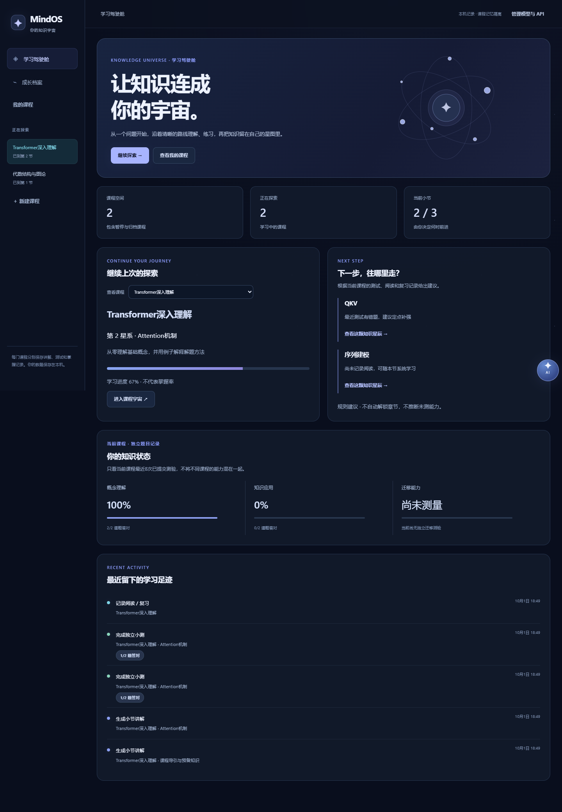

# MindOS

**先审查想学什么，再一节一节学会。** 用户输入课程名称和目标，MindOS 联网检索课程方向，生成通俗的知识范围和小节概览。用户可以提出修改意见反复调研；只有确认最新版审查稿，才创建课程并开始逐节讲解。

## 已实现

- **上下文感知 AI 导师**：按当前课程、知识证据与学习目标选择讲法，支持步骤、对照、图示及单问题引导；只保存学习相关对话和有价值教学记忆，疑似困难先独立检测。窗口可拖动、缩放并在刷新后恢复。详见 [Learning Loop P6](docs/learning-loop-p6.md)。

- **主动学习记录与个人估时**：用户自行开始、暂停和结束学习，刷新后恢复；按完整记录调整今日耗时与负载，提示预算/截止偏差，时长从不影响掌握度。详见 [Learning Loop P5](docs/learning-loop-p5.md)。
- **目标驱动的成长路线**：审查目标能力，复用现有课程，安排复习、独立验证与实践；重大调整保留版本和原因，不改掌握状态或自动推进章节。详见 [Learning Loop P4](docs/learning-loop-p4.md)。
- **个人知识档案与跨课程基础确认**：审查相关知识身份，查看历史课程记录；短测后才确认本课程基础，先验不复制掌握率。详见 [Learning Loop P3](docs/learning-loop-p3.md)。

- **课程审查**：模型拟定搜索词，默认免额外密钥检索 Wikipedia 与 GitHub；Brave、Tavily 及兼容网页搜索服务可选。模型依据结果的标题和摘要生成简明方向、学习成果和小节目录。审查稿及来源保存在本机，刷新后可以继续审查。此阶段不生成具体讲义和题目。
- **用户确认**：可修改课程名称、目标和学习方向并重新调研；旧版审查稿不能误确认。确认后才创建课程。
- **逐节教学**：讲解按节生成并保存；可随时追问，只有点击“进入下一小节”才推进。
- **独立小测**：每次生成 4 道单选题，提交后保存题目、作答、得分和解释；可反复复测旧小节。
- **课程记忆**：每节显示最近两次小测的正确率与暂定状态；后续讲解参考同一课程的错题线索。不同课程与浏览器会话的数据分开。
- **双模式学习**：章节讲解负责从零、连续地学；课程知识地图负责查看关系、复习和补漏，共享同一课程记录。
- **知识原子**：每节少量关键概念、机制、原因或技能；包含一句话定义、用途、学习深度与关系。按需生成快速复习或深入理解，可继续追问、做定点小测。
- **开放能力验证与校准**：掌握报告下可选开放解释、辨析、设计和迁移挑战，自动保存草稿；模型评分仅作影子观察，不改掌握状态。按时间窗口与知识策略版本分析后续独立结果，样本不足不下结论。详见 [Learning Loop P2](docs/learning-loop-p2.md)。
- **课程收尾**：内容学完后，用理解、应用和陌生场景检测生成掌握报告；只补当前缺口，再用新题验证。可暂缓或带缺口结束，长期记忆未测不补分。详见 [Learning Loop P1](docs/learning-loop-p1.md)。
- **证据与学习建议**：阅读记录与测试表现分别统计。章节题目明确关联原子后才更新对应状态；未关联的历史题不会被自动分摊。课程内提供基础摸底、误区识别、前置短时补强、间隔复习与长时间返回后的回忆检测；用户自己决定行动。详见 [学习闭环](docs/learning-loop.md)。
- **自动知识发现与来源偏好**：创建时可填写当前水平、选传资料，并选择“综合资料”或“以我的资料为准”。确认课程后自动分析覆盖与缺口、搜索公开正文并生成待审查候选；保留双方原文的来源冲突，用户核对后才能导入相关候选。详见 [来源偏好与自动发现](docs/source-policy.md)。
- **资料驱动知识生产**：上传 PDF、DOCX、PPTX、Markdown、TXT，粘贴文字或获取公开网页正文；保留章节与来源位置，模型抽取带原文引用的候选，由用户审查后进入当前课程知识地图。详见 [知识生产说明](docs/knowledge-production.md)。
- **密钥管理**：对话模型和网页搜索密钥在本机加密保存，不向网页回显；更换模型地址需要重新填写密钥或明确清除旧密钥。
- **内容复核与历史**：目标、难度或资料变化后，旧讲解会提示需要复核，可重新生成并查看旧版本；同名知识点定义不一致时，需要对照后明确选择采用或保留。详见 [架构修复记录](docs/architecture-fixes-2026-10-01.md)。

项目不包含预设课程或本地 RAG 资料库。课程审查的联网调研只读取搜索结果的标题与摘要，**没有阅读全文，也不保证搜索覆盖整个互联网**；用户可点击来源核对。“资料与知识生产”另有主动获取正文的入口，提取范围及警告会展示。AI 生成的课程和题目未经教师审核，小测正确率不能用于正式能力认证。

## 章节学习与知识地图

确认课程后，可直接从“章节讲解”连续学习，也可进入“知识地图”点击“生成课程索引”或“补全课程索引”。地图只生成简短索引和关系，详细教学内容仍按当前需要生成。既有课程也能用这个入口补建地图，无需删除或重新创建课程。

- 章节里列出关联知识点；看完后点击“本节已读”留下阅读记录。
- 地图可查看各章节原子与前置箭头；点已开放知识点，可快速复习、深入理解、追问或测试，随时回到对应章节。已有章节讲解时可直接做原子测试。
- 可选“基础摸底”仅检查第一节的基础原子，不自动跳过章节。独立测试更新对应原子的近期正确率；阅读或追问不增加正确率。
- 未测原子显示“未测”；平均正确率仅统计已测原子，并同时显示覆盖数。图谱是 AI 建议、题目未经教师审核，不代表正式能力认证。
- 各课程的地图、原子实例、讲解和学习状态独立保存；相同名称不自动合并或转移掌握记录。跨课程共享定义与迁移能力判断仍需后续验证。

## 知识宇宙界面

学习驾驶舱展示当前课程、概念与应用题表现、已有规则给出的学习建议；课程空间提供宇宙总览、学习空间、知识星图、小测反馈和学习记录。星系是课程小节，星辰是知识原子，课程学习仍需用户主动进入下一小节。悬浮导师可跨页面使用、拖动吸附边缘，并按课程保留有限学习问答与位置，窗口可拖动和缩放。

深空主题、原生 SVG 星图和结构化教学块沿用现有后端，无需额外前端构建。迁移能力尚未独立测量时明确显示“尚未测量”，不跨课程合并学习证据。详见[界面与接口适配说明](docs/knowledge-universe.md)。



## 本机运行

需要 Python 3.10+：

```bash
python -m pip install -r requirements.txt
python -m mindos.server
```

打开 <http://127.0.0.1:8765>，在“管理模型与 API”中配置对话模型即可开始。DeepSeek 对话模型的地址可填 `https://api.deepseek.com`，模型名称填 `deepseek-flash`。默认检索无需另配密钥，但只覆盖 Wikipedia 和 GitHub 的公开索引，不等于全网搜索。需要更广的网页检索时，可选配 Brave 或 Tavily 搜索 API 地址与密钥，或通过本机 `.env` 提供 `MINDOS_BRAVE_SEARCH_API_KEY`。搜索词会发送给所选来源，模型服务会收到搜索摘要和审查稿内容；模型与搜索服务可能产生费用。

免密钥入口会优先用中文主题检索中文 Wikipedia、英文主题检索英文 Wikipedia 和 GitHub；无结果时补搜课程名称。三个来源并行请求，每个来源最多尝试两个搜索词，单次请求超时设为 6 秒。结果去重后交替选取不同来源，最多保留 8 条；审查页显示实际搜索词、各来源是否成功及失败提示，刷新后仍可查看。没有任何可用结果时不会生成审查稿。来源仍限 Wikipedia 与 GitHub，并未增加通用网页搜索引擎。

搜索配置在“管理模型与 API”中：选择 **Tavily / 兼容服务** 或 **Brave / 兼容服务**，填写 API 地址和密钥，点击“保存搜索配置”，再在新建课程或重新调研时选择对应检索方式。两种格式分别保存配置，密钥不回显；保存成功仅说明本机已保存，不代表连接已验证。

- Tavily 官方地址：`https://api.tavily.com/search`（只填 `https://api.tavily.com` 也可）。按 [Tavily 官方接口文档](https://docs.tavily.com/documentation/api-reference/endpoint/search)发送 POST JSON 与 Bearer 密钥，读取 `results[].title/url/content`，课程审查只保留短摘要，不请求答案或网页全文；知识生产入口另可主动调用 `/extract` 获取可用正文。
- Brave 官方地址：`https://api.search.brave.com/res/v1/web/search`。使用 GET 与 `X-Subscription-Token`，读取 `web.results[].title/url/description`。
- 第三方服务须兼容所选格式；填写完整搜索接口地址。仅有地址和密钥不能自动适配所有搜索 API。自定义地址收到的密钥和搜索词由该服务处理，结果中的 Brave/Tavily 标记表示接口格式，不认证第三方来源。
- 远程 API 须使用 HTTPS，本机可使用 HTTP；地址不能附带账号、查询参数或片段。更换地址需重新填写密钥。清除密钥后不会恢复旧密钥；Brave 环境变量仅作为未保存配置时的官方入口后备，不会发送到自定义地址。


学习数据默认保存在 `data/mindos-demo.sqlite3`，不会提交到仓库。旧版数据库首次升级时会先在同目录创建 `.before-custom-courses.sqlite3` 备份，再清除旧固定课程记录；模型配置保留。运行测试：`python -m unittest discover -s tests -v`。

当前仅监听本机，浏览器 Cookie 用于区分学习空间，没有正式账号。不要将服务直接暴露到公网或录入真实学生敏感资料。详情见 [运行说明](docs/prototype.md)、[设计大纲](MindOS_最终设计大纲.md)和 [开发路线](ROADMAP.md)。原创项目文件采用 [MIT License](LICENSE)。

知识发现采用“目标与水平 → 知识需求 → 原文覆盖与缺口 → 搜索任务 → 搜索词优化 → 搜索服务”。短关键词可用，模型规划失败时按知识需求、课程信息、课程标题逐级回退；本机诊断日志保留原始输出、解析结果及失败原因。详见 [来源策略与知识发现](docs/source-policy.md)。

新增[课程管理](docs/course-management.md)：查看与编辑课程、拖拽排序、暂停／完成／归档、回收站删除与恢复、结构复制。首页默认展示学习中的课程；复制课程不继承学习记录或掌握状态。

课程悬浮导师现使用 [P6 上下文感知导师](docs/learning-loop-p6.md)，原[课程智能助教](docs/course-ai-tutor.md)接口保留兼容：可拖动的悬浮问答、按课程保存历史与位置、结合当前章节及知识点解释、关联知识点跳转，以及动态信息的搜索来源说明。助教对话不改变掌握率或推进课程。

[教学编排器](docs/teaching-orchestrator.md)按当前小节划分核心、辅助和后续知识，导引课侧重背景与直觉。生成讲解后检查明显超纲，必要时重写一次再保存；检查基于规则，不代表完整语义或事实认证。教学记录与掌握证据分开保存。

[自适应教学智能引擎 ATIE](docs/atie.md)根据学习证据与用户反馈先决定讲法，再生成问题、类比、图示、案例、公式和口头自查等内容块。章节讲解、追问和课程助教共享决策；小测表现会调整后续策略，聊天与自查不更新掌握记录。课程页可设置数学基础和讲解偏好。模型按内容自动选用关系图、流程或比较表，每次追问回答都能继续换讲法、看例子或提交口头自查；正文按段落和编号步骤排版。

[学习闭环核心 P0](docs/learning-loop.md)将实际答题统一为证据，维护理解、应用、迁移、延迟记忆和置信度；未知维度保留未测。课程页可查看建议与依据，短时补强结束返回原位置，章节仍需手动推进。聊天、自查和知识导入不增加掌握度，记忆衰减只用于当前复习建议，不改写历史成绩。

[课程收尾 P1](docs/learning-loop-p1.md)把内容完成与掌握判断分开。最后一节可确认内容学完，再进入限量终局检测和课程报告；迁移题有陌生场景、服务器保存的评价标准与文本重复检查。补强复用 P0，完成后必须定点复测；也可保留缺口暂时结束。未知能力和长期记忆继续显示未测，题目和规则结论不等于能力认证。
