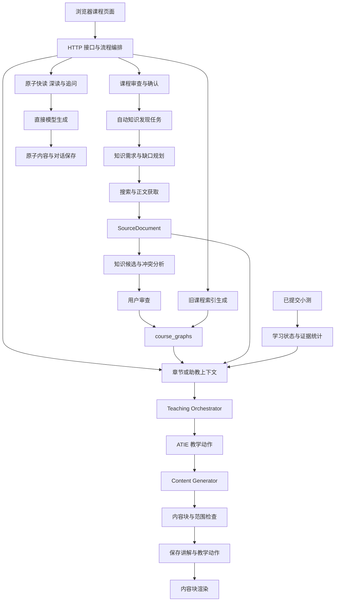

# MindOS 整体架构与模块协作审查

> 以下是修复前的审查快照。F01—F09的当前处理情况与重新验证结果见 [架构修复记录](architecture-fixes-2026-10-01.md)。

审查日期：2026-10-01。以项目根目录当前 Python、JavaScript、数据库结构和接口实现为准，并与 `release/github-publish` 对照；不是仅审查公开仓库的旧提交。发布仓库 HEAD 为 `26f6b45`，新增功能仍包含大量未提交文件。

本次未修改业务代码、测试代码或个人课程数据。只增加本报告与复现结果，运行既有测试，并在临时数据库、临时浏览器课程中验证问题。未调用真实外部模型或搜索服务，也未向外部地址发送任何密钥。

## 结论

整体方向合理，适合继续作为本机可运行的模块化单体。资料、候选审查、知识结构、教学策略、内容生成、掌握证据已经有基本分工，不需要推倒重做或立即引入微服务、独立图数据库。

主要短板是新旧入口没有共享完整的约束，以及同一份课程信息在不同模块中被重复拼装、缓存和解释。部分问题已经影响审查语义、来源策略和教学范围；不能把“102 项测试通过”等同于模块组合已完全正确。

建议优先处理知识审查语义与模型密钥目的地，再统一上下文、教学深度和前端异步请求，随后建立课程与内容版本。

## 当前真实调用关系

图中的旧索引与原子直接生成入口仍在使用；它们与新增教学管线的边界需要明确。

## 模块逐项评价

| 模块 | 合理之处 | 当前协作问题 |
| --- | --- | --- |
| Course Management | 软删除、恢复、排序、复制分离；复制不继承掌握状态 | 目标与难度修改缺少课程版本及内容过期标记 |
| Knowledge Acquisition | 正文与摘要分开，保存原文块、位置、哈希；网页获取阻止本机／内网地址 | 正文选择逻辑被多个调用方重复实现 |
| Knowledge Discovery | 先做需求与缺口分析，有回退、查询去重与执行预算；不自动导入资料候选 | 任务恢复依赖存储初始化；任务状态与服务实例没有明确归属 |
| Knowledge Production / Quality | 引用必须实际存在，导入要用户确认，冲突须保留 | 同名合并可能保留旧定义却把新引用与 verified 状态附上 |
| Knowledge Map / Atom | 课程隔离、前置关系循环检查、阅读与测验分开 | 规划索引与审查知识共用一张图；局部图与完整图缺少完成度区分 |
| Teaching Orchestrator | 当前／辅助／未来范围分开，有明确推进限制 | 不消费 ATIE 的补前置决定，检查范围没有随教学动作调整 |
| Learning State Manager | 未知能力保留空值，偏好／反馈不伪装成测验分数 | 与课程及原子统计重复读证据；窗口、粒度、时间顺序需显式定义 |
| ATIE | 决策与正文生成分开，动作可解释，有策略版本 | 深度枚举与范围模块不同；一部分动作与检查器的约束相互冲突 |
| Content Generator | 类型与顺序检查、一次修订、失败不保存成功动作 | 原子阅读入口没有共享这条管线；上下文构造不统一 |
| Course Tutor | 课程独立历史、请求去重、动态搜索失败明确告知 | 上传资料优先策略在选材时没有落实；与章节上下文选择规则不同 |
| 前端 | 内容块使用安全文字插入，助教保留课程切换保护 | 主章节生成、追问及打开课程缺少统一的迟到响应保护 |
| Storage / ModelGateway | SQLite 事务、密钥加密、模型调用集中 | 存储层包含工作流副作用；模型地址更换与搜索地址更换的密钥保护不一致 |

## 必须优先处理的具体问题

### F01 · P1 · 用户确认的新定义没有真正成为图谱定义

位置：[production.py](../mindos/production.py#L158)。

同名候选合并时，代码只追加引用，刻意保留原来的 `summary`、位置及内容；随后把原子标为 `verified`。用户审查的是新候选，正式图中继续展示的却可能是另一段旧定义。

临时复现：旧 Attention 定义为“所有信息权重相等”；用户确认带真实引用的新定义“根据相关程度分配权重”。导入后旧定义仍然存在，状态成为 verified，引用却指向新定义。这不是独立事实认证问题，而是用户确认对象与保存对象不一致。

建议：同名候选先区分“增加相容引用”和“修改／冲突定义”。定义不同必须让用户审查合并或创建修订版本；不能只靠名称自动合并。历史讲义与测验证据可以保留，但必须注明依赖的原子版本。

### F02 · P1 · 更换模型服务地址会沿用旧服务密钥

位置：[server.py](../mindos/server.py#L369)，对照搜索配置的地址更换检查。

修改已有模型配置的 `base_url` 时，密钥输入为空会继续保存旧密文。后续 `_model()` 解密，`ModelGateway._post()` 会把该密钥作为 Authorization 发往新地址。搜索配置已经要求更换地址重新填写密钥，模型配置没有同样约束。

临时 API 复现：改为另一域名、留空密钥，接口返回 200，旧密文被保留。测试没有向新地址发出请求，不能据此声称现实中已经发生密钥泄露。

建议：至少更换服务域名时必须重新填写密钥或明确清除；由服务地址绑定密钥的使用范围。相同服务仅修改模型名称，可以继续保留密钥。

### F03 · P2 · 来源偏好在章节与助教中执行不一致

位置：[server.py](../mindos/server.py#L188)、[course_tutor.py](../mindos/course_tutor.py#L104)。

章节优先选用户上传资料，再取最多四份。助教按资料创建顺序取最新三份，没有落实 `user_material_first`。创建较新的三个公开来源后，助教上下文可能完全没有上传资料。

临时复现：课程策略为“以我的资料为准”，一份上传资料之后添加三份网页资料；助教选到的三份均为网页，上传资料未入选。已有章节文字可能还带有上传资料的信息，所以这不等于每次回答必然错误，但相同课程策略已经产生不同输入。

建议：抽出统一的课程资料选择服务，按来源偏好、当前目标、章节匹配和预算选择原文块；所有教师入口共用。选中了哪些资料及未覆盖范围都应随教学记录保留。

### F04 · P2 · 教学动作与教学范围的协议没有闭合

位置：[difficulty_controller.py](../mindos/adaptive/difficulty_controller.py#L11)、[atie_engine.py](../mindos/adaptive/atie_engine.py#L15)、[teaching.py](../mindos/teaching.py#L78)、[content_generator.py](../mindos/adaptive/content_generator.py#L97)。

有两个已复现的信号：

- 课程深度用 `conceptual`，ATIE 特殊分支用 `concept`；数学偏好较高时，`allowed_depth=conceptual` 仍产生公式块及结构等级 4，现有检查允许通过。需要明确概念层究竟允许什么，而不是让每个模块解释深度名称。
- ATIE 决定 BACKTRACK，目标为薄弱前置 Attention；编排器仍把 Attention 设为 Level 1。检查器直接读取原始范围，没有把补前置目标提升为此次重点，因此会拒绝对它超过 650 字的集中解释。测试使用了合成的长段落验证这一冲突，并非声称所有真实 BACKTRACK 回答都会失败。

建议：统一深度枚举，输出一个同时包含教学动作和本次有效展开范围的 Teaching Plan。检查器验证同一个 Plan。补前置可以临时展开指定旧知识，未来知识的限制继续保留。

### F05 · P2 · 迟到响应会覆盖用户刚选择的课程

位置：[app.js](../web/app.js#L321)、[app.js](../web/app.js#L422)。

章节生成／追问／小测等完成后直接 `renderCourse()`，没有检查请求发起时的课程与当前选择是否一致。`state.busy` 限制新动作，但课程侧栏和首页仍可切换。

实际浏览器复现：延迟课程甲的讲解请求，在等待期间点击课程乙，页面正常显示乙；放行甲的响应后，页面又变回甲。没有复现数据库中的跨课程混写，问题是页面导航及当前提问上下文被旧响应改回去。

建议：统一导航版本号与请求范围，响应只有在课程、章节和导航版本仍匹配时才能渲染。可取消旧请求，但取消浏览器请求不能代替后端正确保存。

### F06 · P2 · 课程信息、审查稿、知识结构与缓存没有版本关系

位置：[course_management.py](../mindos/course_management.py#L96)、[storage.py](../mindos/storage.py#L254)、[storage.py](../mindos/storage.py#L305)。

编辑课程目标与难度只更新 Course 字段；确认审查稿、章节目的／难度、已有讲义、原子内容没有关联过期机制。章节内容首次生成后固定保存，来源策略和冲突表达修改也不标记旧内容的生成依据。

临时复现：将目标和课程难度改为新值，Course 已更新，旧讲义、旧审查目标和章节 beginner 元数据仍然保留。保留历史是正确的，但当前缺少“历史内容基于旧目标”的提示与后续修订入口。

建议：区分外观修改与教学依据修改；后者递增课程修订号。讲义记录课程、图谱、来源策略和教学计划版本。旧内容不删除、不自动改变掌握记录，但标出生成依据及是否需要用户选择重新生成。

### F07 · P2 · 课程规划索引与正式审查知识没有充分区分

位置：[server.py](../mindos/server.py#L578)、[model.py](../mindos/model.py#L349)、[knowledge.py](../mindos/knowledge.py#L122)、[teaching_state.py](../mindos/adaptive/teaching_state.py#L95)。

旧“生成知识地图”入口根据课程目录直接生成无来源的 AI 索引并保存到 `course_graphs`，其状态为 candidate。资料生产的用户审查结果也进入同一张图。编排器与状态管理器只排除 deprecated，因此旧索引直接参与核心知识、前置关系与教学决策。

这里并不是自动发现偷偷导入了网页候选：自动发现仍保留了审查门槛，界面也提示旧图是 AI 索引。问题在于索引与已审查知识共用同一数据地位，后续同名合并又可能把未审查旧定义变为 verified（见 F01）。

此外，导入少量候选后只要存在图，`/api/knowledge/build` 就不再生成剩余结构；`knowledge.ready` 表示存在图，不能表达整门课程覆盖是否完整。

建议：明确 provisional curriculum index 与 reviewed knowledge 的用途和权限，分别记录覆盖度；无上传资料时仍允许依据目录开始教学，但不能把规划索引当成已有可靠引用。局部图要支持逐步完善。

### F08 · P2 · 数据库初始化承担了任务恢复职责

位置：[storage.py](../mindos/storage.py#L104)、[discovery.py](../mindos/discovery.py#L210)。

每次构造 Storage 都把所有 running 任务改成 interrupted，未判断哪个服务实例负责该任务、任务是否仍存活。DiscoveryEngine 使用进程内 daemon 线程，没有实例归属、租约或续跑标识。

临时复现：创建 running 记录，再对同一数据库构造第二个 Storage；任务变成 interrupted，第二个发现任务可以开始。它会影响第二个服务实例、管理工具或未来工作进程共享数据库的情形；单个现有服务只初始化一次时不会每次查询都触发这个问题。

建议：迁移与任务恢复分离。当前 MVP 可先明确只允许一个服务实例使用数据库；任务记录增加实例归属和存活判断，再由任务服务执行恢复。恢复后重试应继续依赖已保存的正文／候选，而不是重复工作。

### F09 · P2 · 搜索词协议只在自动发现入口统一

位置：[search_planning.py](../mindos/search_planning.py#L27)、[server.py](../mindos/server.py#L531)。

自动发现已取消最小词长，手动资料搜索仍要求 3—250 字。实际临时接口中 `query=AI` 返回 400；“ML”“RL”“图论”也会被同一个条件拒绝。

建议：手动、自动发现和助教都使用同一查询规范化规则；保留去空、无意义字符及合理上限，不再用最小字符数判断合法关键词。

## 结构层面的改进，不应与上述缺陷混为一谈

1. **接口层承担过多流程。** `server.py` 同时处理 HTTP、课程规划、上传解析、选材、图谱、测验和教学串联；`Storage` 继承六个存储混入类，这些类又依赖宿主隐式提供的方法。当前能运行，但新增功能时必须在多处补删除、复制、迁移和上下文。逐步抽出 CourseService、统一 TeachingContextBuilder、AssessmentService 和独立 TaskService，HTTP 只做输入、授权和调用。无需将它们拆成独立网络服务。
2. **协议依靠字典及字符串。** `concept`／`conceptual` 已是具体例子；模型层、存储层、前端分别验证和翻译字段。可将课程上下文、教学计划、内容块与来源引用定义为共享的明确协议；模型输出继续独立校验。可采用现有 Python 数据结构实现，不必为了重构引入新框架。
3. **掌握统计有不同粒度，名称应说明范围。** Course 最近两次章节成绩、Atom 最近两次关联题目、ATIE 最近八份测验的维度统计不是同一指标。保留粒度差异，但共用证据读取及规则标识，说明窗口与范围；“最新测验”应按提交时间定义，现有多处按创建顺序／rowid 排序需要检查乱序提交场景。
4. **原子阅读仍是独立旧教学路径。** 原子快读、深读与追问直接调用模型，未经过 ATIE 和内容检查；这是当前文档已披露的实现范围，不应称为“所有教学入口都自适应”。如果产品要统一教师行为，可在保留原子结构和历史内容的情况下逐步接入同一个生成服务。
5. **来源与任务状态需要区分粒度。** 一个 SourceDocument 可以产生多个章节批次，但 `processing_status` 会被单个批次结果覆盖；资料已解析、所有抽取完成、某一批次已审查不是同一状态。自动发现有预算披露，但剩余工作不是独立的持久化任务队列。后续应区分文档解析状态、批次审查状态和发现任务进度。
6. **日志不是完整追踪链。** 搜索规划有 trace_id，教学、测验和助教原始输出却未统一关联课程、章节、请求及教学计划。日志文件也没有轮转。建议传递同一个请求标识，保留必要原文与修订原因，同时控制日志体积及隐私保留时间。
7. **部署边界仍是本机原型。** 本机监听、Cookie 学习空间和加密密钥适合当前目标，但 model_profiles 是本机共享配置；不能直接解释为正式多用户账号隔离。当前不应因此更换架构，公开部署前才需要明确用户及配置归属。
8. **两个目录的维护有漂移成本。** 本次审查开始时 63 个源代码／测试／文档文件一致。建议固定一份开发来源，由可验证的发布脚本复制允许的文件并检查哈希，排除数据库、配置和密钥；继续满足用户要求的根目录／发布目录同步。

## 值得保留的设计

- 课程、小节、原子内容、来源和学习记录以 course_id 隔离。
- 用户明确推进小节；模型输出、助教聊天和读取状态不推进课程。
- 阅读、来源导入和口头自查不被写成正确率；未知能力没有伪造置信分数。
- 来源正文保留原文块及位置，摘要与正文界限明确，冲突确认不等于事实认证。
- Production 对资料候选的引用验证、用户审查和事务内图谱变更检查已经成立。
- 新章节及助教内容块在保存前检查，语法和内容错误共享一次修订预算；失败不留下成功教学动作。
- 悬浮助教已有分页历史、去重请求和课程切换响应保护；主页面可复用这个方向。
- SQLite、本机 HTTP 服务和原生 JavaScript 对当前可落地 MVP 是合理取舍。

## 建议调整次序

| 阶段 | 工作 | 验收重点 |
| --- | --- | --- |
| 第一批 | F01 同名审查语义；F02 模型密钥目的地 | 确认对象与实际保存定义一致；改服务地址不沿用旧密钥 |
| 第二批 | F03 统一选材；F04 统一教学计划；F05 响应保护；F09 查询规范 | 同策略选到一致来源；补前置与范围检查一致；切课程不被旧结果覆盖；短词可检索 |
| 第三批 | F06 内容版本；F07 索引与审查知识；F08 任务生命周期 | 历史可追溯；局部地图可完善；活任务不会被新存储实例误中断 |
| 持续整理 | 服务边界、证据读取、协议、追踪、发布脚本 | 避免新功能再次复制上下文与跨模块状态判断 |

## 实际验证结果与限制

- 当前完整自动化测试：102 项通过（本次重新运行）。未修改既有测试。
- 七个存储／教学临时探针均得到上述记录；另以临时 HTTP 配置验证了模型地址与密钥行为、短搜索词拒绝。
- 真实浏览器用受控响应延迟复现课程切换被旧请求覆盖；不是仅阅读代码推断。
- 合成定义、长前置解释、临时课程与测试密钥仅用于复现；不代表真实用户学习效果。模型密钥检查未向新目的地发送请求。
- 代码静态审查提出的结构建议与动态复现问题已经分开；未进行公网、多进程压力或真实模型全面评估。
- [可复核的临时探针结果](validation/architecture-review-2026-10-01.json)随报告保存。
