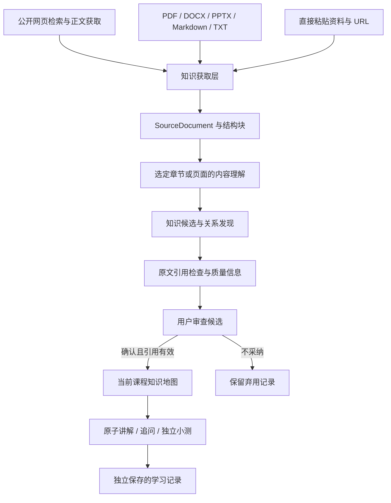

# 资料驱动的知识生产

本次在现有课程、知识原子、知识地图和学习记录之间新增知识输入层，保留已有教学与评估流程。

## 项目分析与改造设计

改造前：浏览器 → 本机 API → 课程审查 / 模型生成 → SQLite 中的课程、图谱、讲解、小测与学习记录。搜索服务已经可配置 Brave、Tavily 地址与密钥，但课程审查仅使用标题和短摘要，没有统一文档、上传解析、原文定位或知识候选审查流程。课程知识地图属于 AI 生成的学习索引，不能视为来自已核验文献的知识库。

新的输入层在独立模块中完成，已有课程和学习数据不重建：

Phase 1 项目审查与 Phase 2 接口设计先于代码修改；Phase 3 增加标准文档与采集接口，Phase 4 接入网页正文获取，Phase 5 增加上传解析，Phase 6 将候选审查连接既有图谱。每阶段使用现有本机 API 与 SQLite，不新增向量库或替换核心系统。

## 数据和模块

| 模块 | 责任 |
| --- | --- |
| `mindos/acquisition.py` | SourceDocument、可替换采集接口、直接输入、五类文件解析、网页正文获取 |
| `mindos/web_search.py` | 现有免密钥 / Brave / Tavily 搜索传输和配置格式 |
| `mindos/model.py` | 根据所选结构理解资料，再抽取概念、方法、关系和真实引用 |
| `mindos/quality.py` | 透明质量信号；未知项不虚构为分数 |
| `mindos/production.py` | 文档和候选持久化、引用核对、用户审查、事务导入 |
| `mindos/knowledge.py` | 保留已有原子结构，增加来源、审查状态及实现/扩展关系 |
| `web/production.js` | 导入、结构选择、候选审查、来源展示 |

SourceDocument 包含 `id/title/source_type/origin/content/metadata/created_time/processing_status`。metadata 保存结构块、层级路径、解析警告、正文哈希、原文件哈希（上传时）以及 URL（网页时）；每块都有稳定编号和可用的行、段落、表格、页码或幻灯片位置。`created_time` 是获取时间，不能作为出版时间。

资料和候选分别存入 `source_documents` 与 `production_batches`，均关联当前课程。默认保存解析后的文字与定位信息，不保存可下载的原始文件；核对复杂内容时仍需保留原文件。当前入口生成 `user_upload/web_search/direct_input`；来源字段可供未来论文、课程资料 Provider 扩展，不宣称已经支持相应专用解析器。

采集 Provider 使用 `acquire(...)`；网页适配器另有 `search(query)`、`rank_sources(results)`、`fetch_content(url)`。搜索传输注入到适配器，正文获取不依赖固定模型或搜索品牌。当前排序只按有无摘要与标题长度作轻量整理，不是权威性排序。未来接 Exa 等服务，需要增加其传输/正文适配器，不能只填地址就自动理解所有接口。

Tavily 的检索继续调用配置的 `/search`；正文采用同一服务的 `/extract`，通过 Bearer 密钥提交 URL，读取实际 `raw_content`。兼容服务必须同时支持这两种路径与格式。HTTP 200 中的失败结果也会报错，绝不把搜索摘要当正文。接口格式依据 [Tavily Extract 文档](https://docs.tavily.com/documentation/api-reference/endpoint/extract)。Brave 与免密钥检索结果可以交给直接网页获取器解析；支持公开静态 HTML / TXT，不绕过登录、不运行网页脚本。

## 使用流程

1. 进入已有课程，展开“资料与知识生产”。粘贴原文、上传文件，或获取公开网页正文。也可以先检索标题摘要，再选择某个结果获取正文。
2. 打开资料，查看结构块及解析警告。选择完整的章节、段落、页面或幻灯片，并指定候选所属课程章节。
3. 点击“理解选定原文并抽取候选”。模型一次返回资料理解、1—6 个候选、原文引用和关系建议。候选不会自动写入图谱。
4. 核对定义、引用与质量信息。确认需要的候选，可从首批候选开始构建课程地图；没有有效原文引用的候选不可导入。也可弃用整批并留下备注。
5. 地图显示导入的知识点，其详情显示文件/网页和原文位置。原有讲解、阅读、追问和测验继续使用既有流程；导入本身不改变掌握率，也不自动进入未来章节。

同名候选在当前课程中追加来源，保留已有定义、位置、原子编号、讲解和测试记录。跨课程相同名称不合并。每节仍最多 6 个原子，课程最多 96 个；达到上限时导入失败并保留候选，用户需要调整选项或所属章节。关系中的 `requires` 转为现有前置边，方向为“所需知识 → 当前知识”；`related_to/contrast` 对应现有相关/对比类型；保留 `part_of`，新增 `implements/extends`。未知编号、自环和前置环被拦截，导入事务失败不会留下半批数据。

## 质量与能力边界

候选质量信息逐项展示来源类型、可用文字完整性、发布时间、多来源一致性及用户反馈。引用必须逐字存在于用户实际选定的结构块中；文件、网页和位置由后端产生，不能采用模型编造的位置。引用一致只说明可追溯，不能证明引用支持定义的全部含义。当前不自动判断论文权威性，不自动取得出版日期，已增加有限范围内的跨文档模型冲突检查，仍不代表完备交叉验证或事实认证；对应项明确显示未知、未核验或存在冲突，由用户审查决定是否采纳。

`candidate` 是未审查；`verified` 是引用检查通过且用户确认；`deprecated` 是未采纳。这里的 verified 不代表教师认证或独立事实认证。未导入与未通过引用检查的候选不会直接污染课程图谱。旧课程以及通过“生成课程知识地图”产生的 AI 索引没有原文证据时显示“尚无资料引用”，不会追溯性伪造来源或认证状态。可信公共定义库、完备跨文档事实判定、教师编辑与版本管理仍是后续任务。

解析按文档结构进行，不按固定字符大小拆片。Markdown 保留标题、定义、公式、实例及代码文字；DOCX 保留标题样式、段落与表格顺序；PPTX 保留标题与幻灯片位置；PDF 使用文字层与页码。复杂公式、图片、图表数据、PDF 阅读顺序和复杂 Office 排版不能保证完整，警告会留存并展示。扫描 PDF 无 OCR；无可读文字时失败。模型会进一步理解可用文字的概念层级，实际教学和知识拆分质量依赖所用模型，不能用模拟测试宣称已经达到真实教学质量。

每份文件最多 6 MB，解压最多 40 MB / 2000 个条目；PDF 和 PPTX 最多 200 页；文档最多 10 万字 / 2000 个结构块，每课程最多 50 份资料。每次理解最多 2.4 万字，超限要求用户选择章节，不能默默截断。网页正文最多 2 MB。公开网页地址检查 DNS 和全部解析地址，连接固定到检查后的 IP，重定向重新检查；拒绝本机、内网和附带账号的 URL。

解析后的资料发送给用户配置的模型；Tavily 正文提取还会把所选公开 URL 交给搜索服务。密钥仍由既有本机加密配置管理，网页不显示密钥。

## API

| 方法与路径 | 用途 |
| --- | --- |
| GET `/api/sources?course_id=...` | 资料摘要与候选批次 |
| GET `/api/source?course_id=...&source_id=...` | 完整解析文字、结构和定位 |
| POST `/api/sources/text` | `course_id/title/text` |
| POST `/api/sources/upload` | `course_id/filename/content_base64` |
| POST `/api/sources/url` | `course_id/url/title/search_mode`；direct/public/brave/tavily |
| POST `/api/sources/search` | `course_id/query/search_mode`；仅索引标题摘要 |
| POST `/api/sources/process` | `course_id/source_id/section/block_ids`；省略 block_ids 时使用全部结构 |
| POST `/api/sources/review` | `course_id/batch_id/action/selected/feedback`；verify 或 deprecate |

## 验证

安装 `requirements.txt` 后运行 `python3 -m unittest discover -s tests -v`。新增测试覆盖五类文件的真实解析（含有文字层 PDF）、结构定位、伪造引用拦截、显式审查、重复导入不破坏学习记录、图谱环回滚、课程和浏览器隔离、Tavily 失败响应、私网 URL 与重定向检查，以及 AI 课程索引不能伪造已认证来源。

可选浏览器验证：启动 `python3 tests/browser_fixture.py`，将其输出的临时 URL、Cookie 分别设置为 `MINDOS_TEST_URL/MINDOS_TEST_COOKIE`，使用已安装 Playwright 的 Node 运行 `tests/browser_production.cjs` 或 `tests/browser_knowledge.cjs`。它们使用临时数据库和模拟模型，不使用真实用户密钥。生产流程脚本覆盖文字与上传、候选不自动导入、确认后地图更新、来源显示、刷新恢复及 390px 手机宽度。

本轮实际验证（2026-09-30）：根目录与发布目录各 29 项自动化测试通过；原有知识地图学习流程与新增资料生产流程浏览器检查通过，含 390px 手机宽度。真实网页正文连通检查被本机 DNS 返回的非公开地址拦截，没有声称读取成功。Tavily Search/Extract 和模型生成用模拟接口验证协议及失败分支，尚未验证真实密钥下的抽取、知识拆分与教学质量。

课程创建时的来源偏好、自动正文发现和冲突机制见 [来源策略说明](source-policy.md)。
