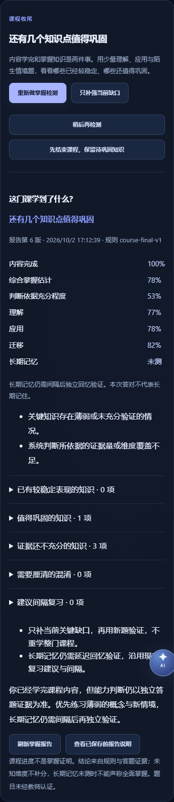

# Learning Loop P1：课程收尾、迁移检测与定点补强

P1 在现有 P0 证据闭环上增加课程层的收尾。课程、小节、知识原子、图谱、ATIE、小测评分和 `KnowledgeStateEngine` 继续使用原实现；`weighted-evidence-v1` 配置没有改变。

## 怎样使用

1. 逐节学习，仍由用户明确点击进入下一节。最后一节生成讲解后，可点击“课程内容已学完”。该操作只记录内容完成，不增加能力分数。
2. 点击“开始课程掌握检测”。按一次一道题的方式回答理解、应用和陌生情境题；答题信心可不选。刷新后保留同一计划、已提交题目和当前待答题。
3. 看报告中的优势、薄弱、证据不足、混淆和复习建议。报告区分内容进度、综合掌握估计和判断依据充分程度；没有对应检测的维度显示“未测”。
4. 有缺口时，选择“只补强当前缺口”。沿用 P0 的诊断 → 必要时短讲解与例子 → 检测 → 返回原学习位置。全部目标完成后，必须用新题定点复测，再判断课程状态。
5. 可以“稍后再检测”，或“先结束课程，保留待巩固知识”。不要求反复检测到通过，也不强制重学整门课程。

课程管理里的“已完成”是用户管理标签；课程掌握状态是独立的规则判断。新复制的课程保留结构，不复制终局计划、报告、掌握度或学习历史。删除到回收站保留记录，恢复后仍可继续；永久删除才清理本课程全部关联记录。

## 规划与生成

```text
内容完成确认 → FinalAssessmentPlanner → 代表性检测计划
                                          ↓
现有 ModelGateway → schema / 范围 / 重复检查 → 现有 quizzes
                                          ↓
现有 submit_quiz → LearningEvidence → KnowledgeStateEngine
                                          ↓
CourseMasteryAnalyzer → 报告快照 → FinalRemediationPlanner
                                          ↓
P0 Repair / ATIE → 定点复测 → 再分析
```

`final_assessment.py` 根据小节 `core_atoms`、前置关系出度与原子深度推导规划重要度；不修改知识原子结构。抽样优先考虑确认混淆、关键知识、薄弱和迁移未测，也保留至少一个已有稳定表现的核心代表。未开放、已废弃或其他课程的原子不能进入计划。

普通计划默认两道理解、两道应用、两道迁移。原子很少时用不同新题复核同一维度。最低目标题量六道，总上限十道，最多两个阶段；第二阶段最多追加两道边界复核题。迁移总量上限三道。定点复测只检查补强目标、相应维度；补了前置知识，还要重新验证原来的高级目标。估计时间随实际规划题量更新。

配置集中在 `mindos/learning/final_policy.json`。这些是原型的初始规则，没有通过真实教学试点校准；不应当作标准化考试阈值。

## 迁移题的能力边界

第一版使用**陌生场景四选一＋服务器判分**，不做开放题 LLM 主观评分。模型输出包含：`scenario`、`question`、`target_atom_ids`、`rubric`、`expected_concepts`、`difficulty`、`novelty_reason`、选项、答案及解释。

场景、问题、目标及类型经严格 schema 检查。只关联当前规划目标；评价标准编号不能重复。答案、评价标准和预期概念保存在服务器，待答题及 Tutor 上下文不包含这些字段。提交后沿用现有服务器评分。

陌生性检查比较本课程最近题目与全部已生成讲解段落，进行 Unicode 归一化、变量／数字替换、文本相似度及二元词片段重合检测。不能仅替换数字或变量。验证失败最多自动修订一次；仍失败则该项保留未测，普通应用题不能充当迁移题。

**这些措施是结构和文本重复防护，不能独立证明语义陌生性或事实正确性。** 模型生成的题目、答案和评价标准仍需要教师或真实试点审核，不能称为事实认证或学习效果证明。

普通理解／应用题失效时，可复用同课程、同原子、同能力类型的历史已提交题作为练习；保存 `reused_question`，按 P0 降权，不能用于独立终局通过。没有题源不记答错或零分。

## 掌握判断与长期记忆

课程分数按规划重要度加权聚合已有原子状态。未知维度继续为 `null`，不填零，也不把掌握度替代长期记忆。系统置信度对所有课程原子聚合，未测原子不会凭空提供信心。

判为 `mastered` 需同时满足：

- 内容完成且当前结构下的终局计划完成；
- 加权掌握估计达到阈值，关键原子无明显薄弱或未知；
- 系统置信度和理解／应用／迁移覆盖足够；
- 无尚未解决的确认混淆；
- 有理解、应用、迁移三类独立终局证据，答对比例达到阈值；
- 已测的关键长期记忆不存在明显薄弱。

`mastered` 在界面称为“当前能力较稳定”。长期记忆仍未充分测到时，会同时显示“长期记忆待验证”，不声称全面掌握。代表性小测不能自动补足所有原子的证据；全答对但证据量、置信度或关键覆盖不足时，仍保留缺口。

同一课程结构下的**已完成**历史终局计划可支持定点复测，每个原子／维度只采用最新独立结果作终局验证。原子状态本身仍由 P0 保留全部合法证据计算；没有删除历史错误。暂缓、失效结构、求助或复用题不能提供新的独立终局通过依据。

长期记忆题只在距最近独立答题达到 P0 的 `minimum_delay_hours` 后规划，并优先于同轮其他讲解或检测。是否真正写入 retention，仍由 P0 根据延迟与提示使用判断。补强后立即回答不能伪装成长时记忆；如果只缺延迟验证但间隔未到，提示等待已有复习安排，不创建空评估循环。不新增第二套复习调度；已结束课程也可出现在原有每日复习建议中。

## 助教、并发与恢复

终局检测仍保留悬浮助教。服务器把当前待答终局题绑定到实际目标小节，即使它不是最后一节。只传公开题面与学习状态，默认引导思考；用户明确要求答案时可以解答，但求助会保存 `hint_used`。客户端提交 `false` 不能清除已有提示标记。

题目生成在网络调用后重新检查课程所有权、计划状态、结构版本与当前待答项目。关键写入使用 `BEGIN IMMEDIATE`，数据库限制每门课一个 active final plan。并发开始／生成不能写入两份当前计划或题目。暂缓和课程目标／图谱变化后的旧题提交会被拒绝。

终局补强与 P0 短任务的绑定在同一事务中完成；暂缓同时停止已绑定的短任务，防止生成期间遗留可提交的孤立补强任务。P0 深度、次数和冷却限制继续生效；用户可以回看或向导师提问，不自动无限补强。

## 报告与预测记录

报告底层分数、状态、原子分类、判断原因和下一步建议全部由程序生成。每个版本保存不可变 `result_json`，保留课程结构版本与来源状态版本。更新后的学习证据产生新版本，不改旧报告；每日时间投影或复习状态变化也可使报告过期。GET 报告不调用模型、不写学习状态。

可选“通俗说明”只解释给定程序事实；模型看不到用于重新算分的原始分数，不能新增状态、分数或认证声明。严格检查状态与说明格式，失败修订一次后使用规则说明。明确否定“全面掌握／认证”的句子允许通过，肯定声明拒绝。说明单独缓存，不覆盖底层结论。自由文字解释仍不替代程序报告。

保存规划开始和重要课程判断时的预测快照。后续实际答题关联到先前快照，以证据游标排除当前结果向自己提供验证。仅记录，不训练、不自动调参数、不跨课程合并能力。

读取课程上下文批量查询已存状态；历史终局使用一次带索引的查询获取每个原子／维度最新独立结果，不逐计划回放。现有 `KnowledgeStateHistory` 保持原设计，新增增长监控测试，没有进行事件溯源改造。

## 存储与接口

新增表：`course_final_completion`、`final_assessment_plans`、`course_mastery_states`、`course_mastery_reports`、`course_repair_plans`、`learning_prediction_snapshots`、`learning_prediction_outcomes`。迁移只新增结构，不自动替已有课程确认完成或掌握。不新增题目／原子／图谱表。

| 接口 | 用途 |
| --- | --- |
| GET `/api/courses/{id}/final/status` | 完成资格、规划、当前待答题、掌握状态和补强 |
| POST `/api/courses/{id}/final/complete-content` | 明确记录内容完成 |
| POST `/api/courses/{id}/final/start` | 创建／恢复计划；`reassessment:true` 定点复测 |
| POST `/api/courses/{id}/final/assessment` | 获取已存题或生成下一题 |
| POST `/api/quizzes/submit` | **原有评分接口**，终局也使用它 |
| GET `/api/courses/{id}/final/report` | 读取报告和最近版本 |
| POST `/api/courses/{id}/final/report` | 刷新规则报告；可选 `summary:true` 缓存说明 |
| POST `/api/courses/{id}/final/defer` | 暂缓；`end_with_gaps:true` 带缺口结束 |
| GET `/api/courses/{id}/final/remediation` | 读取当前状态与补强计划 |
| POST `/api/courses/{id}/final/remediation-start` | 启动课程级补强编排 |
| POST `/api/courses/{id}/final/remediation-target` | 把一个规划目标接入 P0 Repair |

兼容嵌套的 `/final/remediation/start` 与 `/final/remediation/target` 路径。状态、分数、目标或规划字段不能由前端回写。

## 验证与复现

先只读检查文件和 Git，审计见 [P1 审计](learning-loop-p1-audit.md)。单元／HTTP 集成检查：

```bash
python3 -m unittest discover -s tests -v
```

浏览器检查使用临时数据库、合成课程、本机假模型服务及 Edge：

```bash
python3 scripts/check_browser.py final loop presentation universe management
```

按现有浏览器脚本配置 `MINDOS_NODE` 与 `PLAYWRIGHT_MODULE_WINDOWS`。不读取个人学习记录。验证记录见 [自动化与浏览器结果](validation/learning-loop-p1-2026-10-02.json) 及 [真实模型结构检查](validation/learning-loop-p1-real-2026-10-02.json)。后者仅复用本机加密模型配置，所有课程和回答均为合成数据；不代表真实学习效果。报告说明曾回退，修正否定句误判后做了单独真实模型复查，过程在记录中保留。


