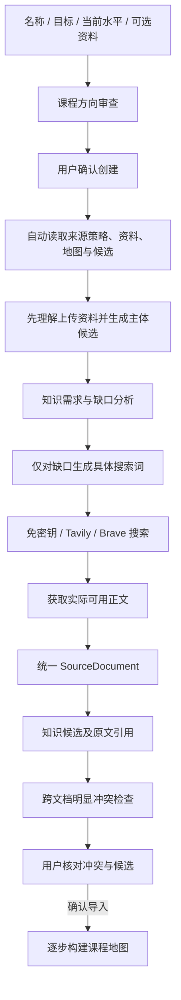

# 课程来源偏好与自动知识发现

课程确认创建后，本机后台自动读取课程名称、学习目标、当前水平、来源偏好、已保存资料、课程知识地图和已有候选，分析知识需求与缺口，再检索和获取公开正文。用户不需要先手动点击网页搜索。手动搜索、上传、粘贴、正文选择和人工处理仍保留，用于补充或纠正自动分析范围。

## 两种偏好

| 策略 | 界面名称 | 行为 |
| --- | --- | --- |
| balanced | 综合资料（推荐） | 上传资料作为重要课程上下文，与公开资料一起用于理解、补充与发现事实问题；不自动赋予上传资料权威性。 |
| user_material_first | 以我的资料为准 | 创建课程时沿用上传资料的主体标题顺序、术语与重点。先从用户资料生成主体候选，再按缺口找公开资料补充解释、前置、实例、最新信息和冲突检查。 |

没有上传资料时采用 balanced，当前水平默认零基础。有上传资料时，创建表单显示来源偏好。每门课程保存自己的偏好，不改变其他课程。创建后可以在“资料与知识生产”中更换偏好；自动发现运行中不能更换，避免任务中途使用不同策略。已有讲义、地图定义与学习记录不会被偏好切换静默覆盖；新任务会使用新的偏好，旧候选仍记录生成时的偏好与水平。

“以我的资料为准”只约束教学组织，不表示用户资料最可靠；也不会隐藏明显冲突。模型教学会收到当前课程的资料范围、来源偏好、水平、引用和冲突记录，已确认的教学表达作为教学上下文。已有讲义不自动重写，原定义保留供追溯。

## 自动流程

没有上传资料时，创建审查仍保留既有标题摘要检索，供用户确认课程方向；确认后独立执行正文发现与候选生产。有上传资料时，先根据已解析资料拟定审查稿，避免无条件重新检索整门课程。资料优先模式使用一级、二级标题按出现顺序建立主体目录，最多16节；完整资料仍保存在课程中。标题提取是首版规则，复杂材料的目录仍需在课程方向审查中检查。

覆盖判断是模型建议，必须提供当前选定原文中的真实文档编号、结构块和引用。标题相同、已有 AI 索引或已有测试分数不等于资料覆盖或事实认证。有原文覆盖的定义、前置、实例和关系不重复搜索；仅核验与时效缺口可针对已出现知识继续搜索。若只有用户资料且模型认为内容全部覆盖，仍明确保留一项关键定义的公开对照缺口，而不是把用户资料直接当成事实认证。

例如资料已包含 Attention、QKV、Softmax 的定义，检索可以转向缺少的矩阵乘法直觉、前置概念或应用例子，不应再次对这些定义进行无理由的重复搜索。

## 后台记录与失败处理

新增 `mindos/discovery.py`，通过注入的模型和采集 Provider 工作，不写正式图谱、讲义或掌握状态。Course 与 course_drafts 增加 `source_policy/learner_level/search_mode`，旧课程无损迁移为 balanced、零基础、免密钥入口。创建时上传的文档先与审查稿关联，确认课程时在同一事务中转入该课程，重复确认不重复复制资料或启动发现。

`discovery_runs` 保存阶段、覆盖证据、缺口搜索词、实际正文、候选批次和失败原因。同一课程只有一个活动任务；其他课程记录隔离。模型与搜索配置在任务启动时读取，不把密钥存入发现报告。服务重启后遗留任务标为中断，界面可重新分析；运行中的任务不是跨进程持续执行的调度服务。

每次最多查看10份资料，优先用户资料；主体抽取最多3份用户资料，每份选取最多2.4万字的完整结构块，按匹配课程标题归属章节。需求分析每文档最多8000字，冲突比较当前文档与最多5份其他资料（优先用户资料），其他资料每份最多8000字。正文获取与解析继续使用既有文件、URL、体积和公开地址检查。分析范围会显示在任务记录中；预算外、未选定或未成功解析的资料不等于知识不存在。

每次最多执行3个新的具体缺口查询，每个查询最多尝试3个结果获取正文。查询完成后不会在重试中无条件重复；后续运行优先推进剩余缺口。正文已保存而模型处理失败时，重试先复用正文，避免重新下载同一页面。无结果、正文不可获取、模型失败会保留课程与已有候选，并报告部分完成或失败。检索覆盖仍由所选入口决定，免密钥 Wikipedia/GitHub 不等于全网搜索，也不能保证所有公开网页都能提取正文。

## 来源冲突

跨文档模型检查只处理明显事实、定义或关系矛盾；单纯措辞差异或信息缺失不应当作矛盾。返回的双方引用必须逐字存在于本课程实际选定原文中，模型不能伪造文件、URL、页码或引用。缺乏真实证据的冲突分析会失败，不能悄悄当成“没有冲突”。

`source_conflicts` 保存：来源 A、来源 B、双方实际文档及类型、原文位置、冲突内容、课程拟采用/用户确认的教学表达、是否确认及时间。资料优先模式可拟采用用户资料表达，但界面明确显示“外部资料存在不同表述/事实冲突”；综合模式不静默选择某个来源。用户填写和确认教学表达后，冲突证据仍保留，也不声称完成事实认证。

未确认的冲突会阻止相关文档的候选导入，包含冲突出现前已生成的候选。确认冲突不会自动导入候选；仍需用户单独确认候选，且引用有效。没有地图时可从已确认候选构建部分地图，后续逐步覆盖其他章节，不必先生成一份无来源的 AI 地图。已有地图、原子编号、阅读、讲解、测验和掌握记录继续保留；课程未来章节仍须用户主动进入。

冲突发现是有限范围内的模型建议，不是完备的矛盾证明或权威性判定。无冲突记录只意味着本次未记录明显矛盾，不能宣称全部知识已核验。`candidate/verified/deprecated` 语义保持不变，verified 仍只代表有效引用与用户确认。

## 接口和验证

- POST `/api/courses/draft` 新增 `learner_level/source_policy/uploads`；uploads 使用文件名与 base64，最多3份、总计6 MB；修订审查稿时默认保留其解析资料。
- POST `/api/courses/confirm` 自动启动发现，不阻塞用户等待全部模型和网络请求。
- GET `/api/sources?course_id=...` 同时返回 discovery 和 conflicts；界面显示阶段、范围、缺口及错误，运行时更新进度。
- POST `/api/discovery/start` 重新分析当前资料与地图，补剩余缺口或重试失败内容。
- POST `/api/courses/source-policy` 更新当前课程偏好。
- POST `/api/conflicts/confirm` 保存用户选择的教学表达；不改变图谱或掌握状态。

`tests/test_discovery.py` 验证不上传也能自动获取正文、真实覆盖证据、资料优先顺序、缺口搜索抑制、冲突导入门槛、原文伪造拦截、重复查询避免、复用失败正文、剩余缺口推进、实际旧表无损迁移，以及课程隔离。接口测试覆盖创建上传、偏好与水平保存、自动启动、重复确认与非法策略。

可选浏览器：启动 `python3 tests/browser_discovery_fixture.py`，使用其输出的临时 URL 与 Cookie 设置 `MINDOS_TEST_URL/MINDOS_TEST_COOKIE`，通过已安装 Playwright 的 Node 运行 `tests/browser_discovery.cjs`。覆盖无上传创建、自动正文候选、资料优先目录、冲突导入拦截、确认教学表达、引用显示、刷新和390px手机宽度。它使用临时数据库、模拟模型与模拟公开正文 Provider，不代表真实模型与 Tavily 服务已经联调成功。

本轮实际验证（2026-09-30）：43项自动化测试在项目根目录与发布目录通过；无上传自动发现、资料优先创建、冲突确认与导入、原文显示、刷新和手机布局的浏览器流程通过。原有地图学习、阅读与测试分离、追问、主动进入下一节的浏览器回归检查通过。真实模型、搜索服务的教学质量与完备冲突识别仍未完成联调验证。

## 知识发现规划（需求优先）

课程审查与确认后的自动发现共用 `build_search_plan`：课程目标与水平 → 知识需求规划 → 基于真实引用的覆盖／缺口分析 → 搜索任务生成 → 搜索词规范化与语义扩展 → 当前搜索服务。搜索词不再有字符长度限制，AI、ML、RL、图论等短词合法；每轮最多执行三个搜索词，剩余任务保留到后续发现。

每个 Search Task 保留 `knowledge_target`、`purpose`、`search_intent`、`queries`、`preferred_sources`、`priority`，以及对应小节与缺口类型。任务只对应已分析的缺口，优先来源是参考偏好，不能保证当前入口覆盖这些来源，更不代表事实认证。免密钥入口仍仅检索 Wikipedia 与 GitHub 公开资料，课程审查仍只使用标题和短摘要；确认课程后另外获取公开正文。

规范化会去空、合并空白、统一全角、过滤无意义字符、忽略非文字搜索项并去重。仅有主题名的词会结合课程名称与任务意图扩展。已覆盖的定义不会生成普通定义任务；明确的核验或时效任务仍可检索。已有原子／候选只有其引用能在本次选定原文中验证时才参与覆盖判断，导入状态本身不证明覆盖或事实正确。

任务模型失败或输出不可用时，顺序回退到知识需求 → 课程目标和水平 → 课程标题。需求规划本身失败时，按课程小节执行本地保守原文检查，并明确标记回退；这种检查只判断真实段落是否提及目标，语义覆盖仍需审查。没有缺口时不触发标题回退。搜索服务失败仍明确报告，不编造资料。课程审查失败原因与规划保存在审查稿的检索报告中，确认后的规划保存在课程发现记录中。

诊断日志默认位于当前运行目录对应项目的 `data/discovery-diagnostics.jsonl`：记录关联编号、课程、阶段、模型原始文本、结束原因、JSON 解析结果、缺口／任务／最终搜索词与失败原因，包含被截断或无法解析的输出。日志只留本机，不通过网页接口返回，不同步发布；模型密钥不写入日志。日志可能包含课程目标与资料摘录，仅适合本机排错，可手动清理。它是诊断记录，不是来源文档或知识证据。来源、知识候选、图谱与掌握记录的现有审查规则保持不变。
